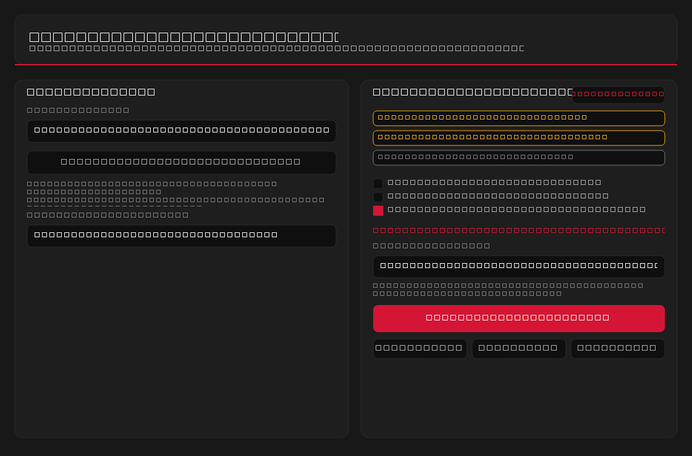
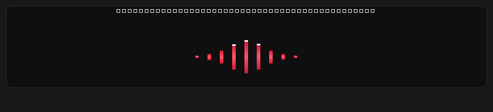
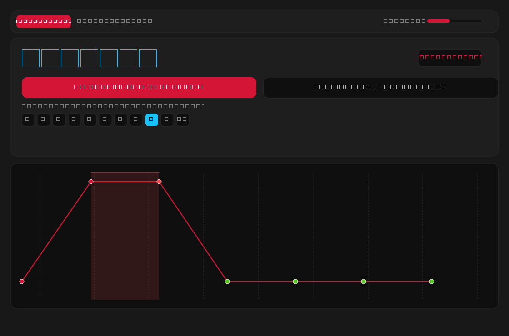
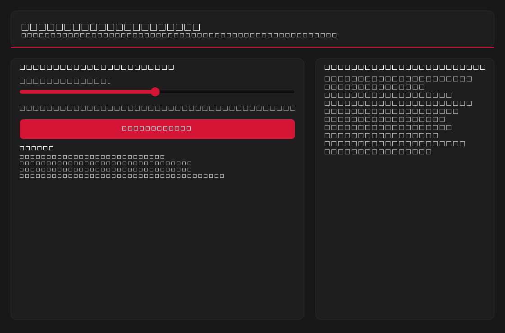
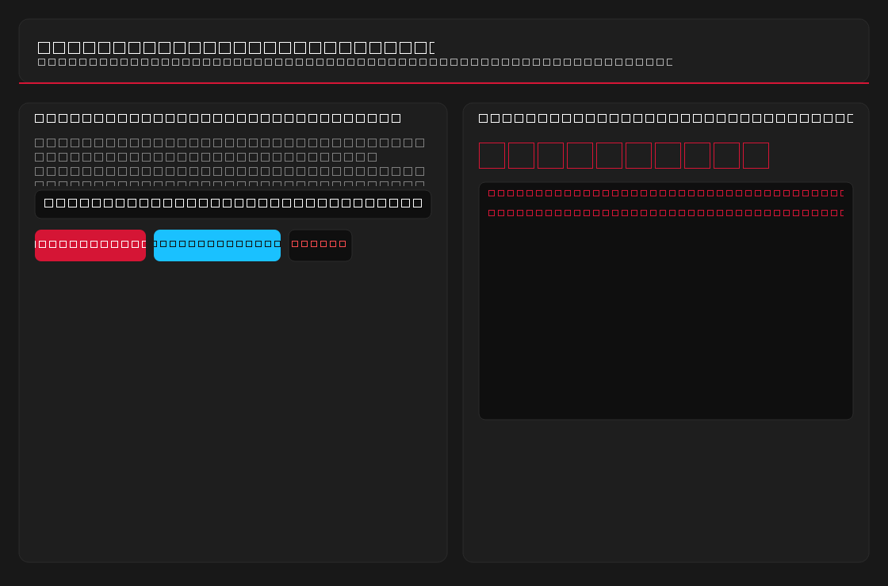
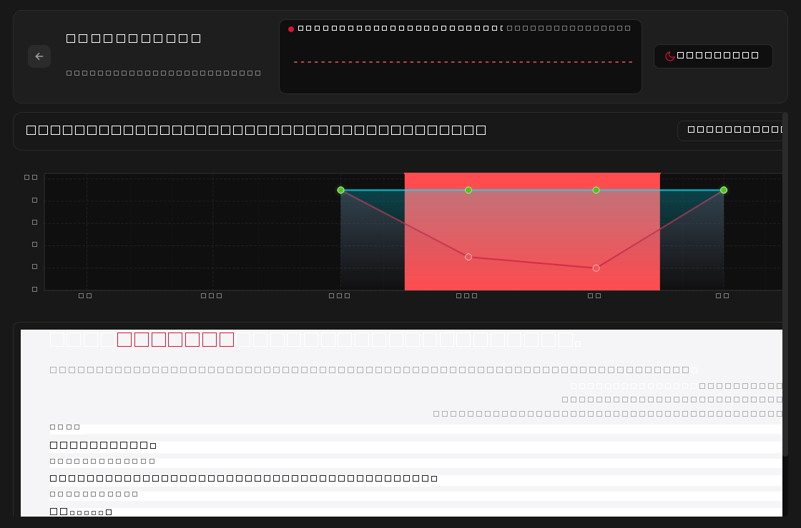
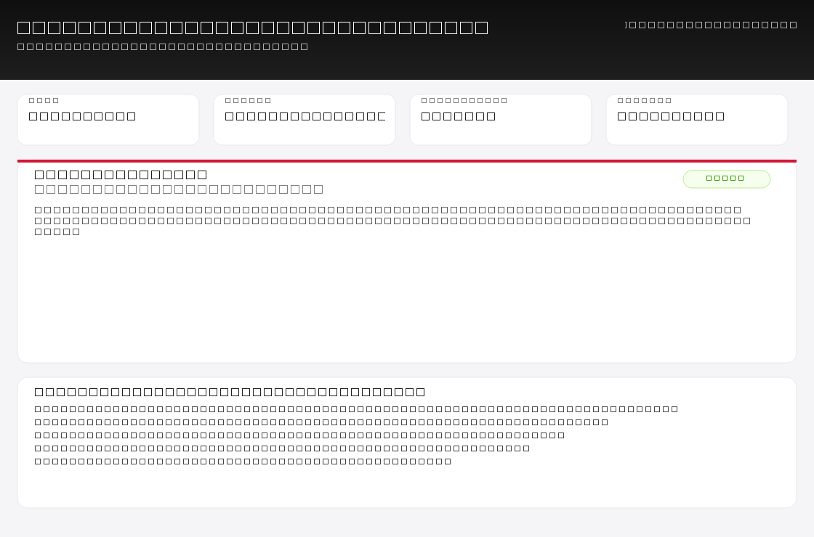
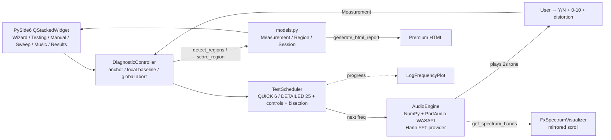

# FreqChecker — Adaptive Speaker Frequency Diagnostic Tool

<p align="center">
  <a href="https://github.com/Biswajit-Sahoo-13/FreqChecker"></a>
  
  
  
  
  
</p>

> **FreqChecker** is an optimized, standalone Windows desktop application (`freqchecker.exe`) engineered to test the **entire speaker + playback-chain** frequency response adaptively. It identifies *perceptual* acoustic anomalies (what *you* hear under current conditions), verifies false-positives with **local geometric bisection**, and evaluates **cross-channel differentials** to separate DSP/room artifacts from true driver faults.

**Repository:** [`https://github.com/Biswajit-Sahoo-13/FreqChecker`](https://github.com/Biswajit-Sahoo-13/FreqChecker) · Clone: `https://github.com/Biswajit-Sahoo-13/FreqChecker.git`

---

## 📚 Table of Contents

- [Technical Specs](#-technical-specifications--low-end-pc-optimization)
- [Key Highlights](#-key-highlights)
- [Technology Stack](#%EF%B8%8F-technology-stack)
- [Directory Structure](#-directory-structure)
- [Screenshots](#-screenshots--demo)
- [Architecture](#%EF%B8%8F-architecture)
- [Usage Guide](#-usage-guide)
- [Quickstart](#-quickstart)
- [Command-Line Flags](#%EF%B8%8F-command-line-flags)
- [Features](#-features)
- [System Requirements](#%EF%B8%8F-system-requirements)
- [FAQ](#-faq)
- [Roadmap](#%EF%B8%8F-roadmap)
- [Changelog](#-changelog)
- [Troubleshooting](#-troubleshooting)
- [Documentation](#-documentation)
- [Contributing](#-contributing)
- [License](#-license)

---

## 🔬 Technical Specifications & Low-End PC Optimization

For an in-depth breakdown of the adaptive grid, geometric bisection, Hann-windowed FFT, dual-confidence math, memory budgets (RSS < 120 MB), and full architecture, see:

**[`TECH_SPECS_AND_OPTIMIZATION.md`](https://github.com/Biswajit-Sahoo-13/FreqChecker/blob/main/freqchecker/TECH_SPECS_AND_OPTIMIZATION.md)** — also available locally at [`freqchecker/TECH_SPECS_AND_OPTIMIZATION.md`](./TECH_SPECS_AND_OPTIMIZATION.md).

### ✨ Key Highlights

**Algorithms**
- **1/3-Octave Logarithmic Grid** `63 Hz → 16,000 Hz` — ~25 detailed / 6 quick points (log-spaced, not linear).
- **Geometric Midpoint Bisection** `sqrt(f1·f2)` refinement to **±1/12 octave** (`STOP_RATIO = 2^(1/12) ≈ 1.059`) — honest bracket `start–end ±3–50%`.
- **False-Abort Bass Roll-Off Shielding** — excludes `≤250 Hz` roll-off from global abort to protect healthy laptop speakers; `is_low_rolloff` requires recovery within an octave.
- **Single-Response Outlier Retest** — isolated `BAD/BORDERLINE` flanked by `GOOD` is retested; `input_error` vs `verified_suspicious` prevents ghost regions.
- **Dual Confidence Engine** — `Anomaly 0–95%` (consistency 35% + depth 25% + retest 20% + control 10% + plausibility 10%, caps 35/55 for singletons) × `Hardware 0–95%` (roll-off ×0.20, DSP ×0.30, unstable ×0.60, symmetrical ×0.45, asymmetrical ×1.15).
- **Cross-Channel Differential** — symmetrical dip within `1/6 octave` ⇒ DSP/room, asymmetrical ⇒ driver fault; bilateral HF roll-off ⇒ hearing threshold.

**Technology Stack**
| Layer | Choice | Why |
|---|---|---|
| Runtime | **Python 3.11+** | Single-file `PyInstaller` without VS toolchain |
| GUI | **PySide6 (Qt 6)** | High-DPI `QPainter` log plot, `QSS` FxSound tokens, frameless chrome |
| DSP | **NumPy 2.x** | Vectorized `sin` + Hann FFT, no SciPy |
| Audio | **PortAudio / `sounddevice` + WASAPI** | Low-latency, device-adaptive `sample_rate`, `generation` thread-safety |
| Typeface | **Manrope** (bundled `fonts/Manrope.ttf` via `QFontDatabase`) | FxSound-style, no system dependency |
| Packaging | **PyInstaller 6.x** `--onefile --windowed` | ~58 MB `freqchecker.exe`, 30+ Qt modules pruned, `UPX` |

---

## 📁 Directory Structure

```text
FreqChecker/                          # ← https://github.com/Biswajit-Sahoo-13/FreqChecker
└── freqchecker/
    ├── freqchecker.exe                # Standalone Single-File Windows Executable (58 MB)
    ├── app.py                         # Main PySide6 Application (Wizard, Runner, Manual, Sweep, Music, Dashboard)
    ├── diagnostic_core.py             # Adaptive Algorithm Controller & Confidence Math
    ├── audio_engine.py                # Low-Latency Synthesis, Hann FFT & Worker Thread
    ├── models.py                      # Data Structures, CSV/JSON, Premium HTML Report
    ├── ui_components.py               # FxSound Spectrum Visualizer & Log-Frequency Plot
    ├── fx_theme.py                    # FxSound Design Tokens (27), Dual-Theme QSS & Font Loader
    ├── icons.py                       # Vector SVG Icon Renderer (no platform emoji)
    ├── fonts/Manrope.ttf              # Bundled UI Typeface
    ├── test_diagnostic.py             # Automated Unit Test Suite (44 tests, 500-iter fuzz + oracle)
    ├── build_exe.py                   # Optimized Selective PyInstaller Packaging Script
    ├── requirements.txt               # Pinned Dependency Manifest
    ├── TECH_SPECS_AND_OPTIMIZATION.md # Comprehensive Algorithms & Performance Specs
    └── README.md                      # This file
```

Live repo: [`github.com/Biswajit-Sahoo-13/FreqChecker`](https://github.com/Biswajit-Sahoo-13/FreqChecker) · Issues & Discussions welcome.

---

## 🚀 Quickstart

### 0) Clone

```bash
git clone https://github.com/Biswajit-Sahoo-13/FreqChecker.git
cd FreqChecker/freqchecker
```

### 1) Launch Standalone Executable (no Python needed)

Double-click `freqchecker.exe` inside `freqchecker/` — or run:

```powershell
.\freqchecker.exe
.\freqchecker.exe --frameless   # default FxSound chrome
.\freqchecker.exe --framed --light
```

### 2) Run from Source

```bash
cd freqchecker
pip install -r requirements.txt
python app.py                 # default dark, frameless
python app.py --framed --light
```

### 3) Run Automated Tests

```bash
cd freqchecker
python -m unittest test_diagnostic -v
# or
python test_diagnostic.py
```

### 4) Recompile Executable

```bash
cd freqchecker
python build_exe.py           # runs tests → PyInstaller → freqchecker.exe + dist/freqchecker.exe
```

> The script auto-runs the test suite before building and copies the fresh exe to both `freqchecker.exe` (beside source) and `dist/freqchecker.exe`.

---

## 🎛️ Command-Line Flags

| Flag | Effect |
|---|---|
| *(default)* | FxSound-style **frameless** chrome (`21px` radius, `38px` title bar, `— □ X`) |
| `--framed` | Use the **native OS** window title bar instead |
| `--frameless` | Force frameless (explicit, default) |
| `--light` | Start in **light theme** (`#f5f5f5 / #1ac1ff`), default is dark `#181818 / #d51535` |

Examples:

```bash
python app.py --light
freqchecker.exe --framed
```

---

## 🔍 Features

- **Guided adaptive diagnostic** — 1/3-octave coarse grid (25 detailed: 63–16k / 6 quick: 250–8k, laptop-friendly), periodic `1 kHz` reference controls (every 8 detailed / 3 quick), isolated retests, bounded bisection to `±1/12` octave, `global_refine_count < 24`.
- **Quick vs Detailed** — Quick starts at **250 Hz** to skip inaudible sub-bass on small drivers; `Include sub-bass (63–200 Hz)` toggle restores `125 Hz` for headphones/large monitors. Detailed always full-range with roll-off-aware scoring.
- **Blind Mode** — hide tone frequencies until rated to reduce expectation bias.
- **Undo (Z)** — step back one rating and replay the same tone; `R` replay, `Y/N`, `0–9`/`T=10` one-touch.
- **Live 9-band spectrum monitor** — **genuine Hann-windowed FFT** (`256` Hann, `rfft`, `20–20000` band power) of the *playing buffer*, not a simulation; 30 FPS mirrored scroll (`4px bar / 9.55px pitch`), crimson `→` cyan gradient, peak caps, idle desaturation.
- **Log sweep with anomaly marking** — `100 Hz → 10 kHz` 10–60 s `QTimer 50 ms`, `Space` to mark, `35 ms` latency compensation, then **Retest Marked Frequencies** through the guided flow.
- **Manual tone generator** — `Sine / Triangle / Pink` (`1/√f` FFT-shaped), `20–20000 Hz` log-mapped slider `f=20·(1000)^(pos/1000)`, `0.5–10 s`, `L/R/Both` with raised-cosine fades.
- **Music A/B mode** — load `WAV/FLAC/OGG/MP3/AIFF` via `soundfile`, `60→8 ms` fades, `L/R/Both` instant channel switch, `0–100%` volume, seek permille, `OutputStream`-style.
- **Stress replay** — replay worst point at **+75%** (`peak 0.7`) to distinguish level-dependent distortion vs true dip.
- **Results dashboard** — dual-channel **log-frequency plot** `50–18000 Hz` (major `63–16k`, minor grid, `QPen` dashed), shaded anomaly (red `35α` / roll-off grey), hover `QToolTip` + `click-to-replay`, filter `Both/Left/Right`.
- **Premium report** — export **`Premium Report (.html)`** via `Session.generate_html_report()` — gradient header, KPI grid, channel cards with severity pills + confidence bars, cross-channel differential, print-ready `@media print`, also `CSV (raw)` + `JSON (session)` + `Text` fallback; in-app `QTextEdit` preview via `setHtml`.
- **Partial-save protection** — stopping mid-session or `closeEvent` on `PAGE_TESTING` offers `Save Partial / Discard / Cancel` to `saved_sessions/session_*.json`; `load Previous Session JSON` restores.

---

## 📸 Screenshots & Demo

> The app is frameless by default (`— □ X` custom chrome, `21px` radius). All screenshots below are dark theme `#181818/#d51535`; light theme `#f5f5f5/#1ac1ff` is identical in layout.

| Wizard — Device & Pre-Flight | Live 9-Band Spectrum (68px) | Testing — 1-Touch Rating |
|---|---|---|
|  |  |  |
| `QSplitter` `480↔520` (responsive `V` <1020px) | Hann FFT 30 FPS, peak caps | `Y/N`, `0–9`/`T=10`, `R`, `Z` undo |

| Manual Tone | Log Sweep | Results Dashboard | Premium HTML Report |
|---|---|---|---|
|  |  |  |  |
| Log-mapped `20–20000` slider | `Space` to mark, retest flow | Log plot `50–18000` + shaded bands | `Print → Save as PDF` |

> **Tip:** If images are missing locally, generate via `python app.py --light` and screenshot `1120×740`. The repo includes `docs/screenshots/` placeholders — replace with your captures before release.

---

## 🏗️ Architecture

### High-Level Data Flow



### Module Map

| File | Responsibility | No Qt? |
|---|---|---|
| `fx_theme.py` | 27 FxSound tokens, `QSS` generator, `Manrope` loader, `painter_palette()` | — |
| `icons.py` | SVG → `QIcon/QPixmap` (`logo-bars`, `minimize`, `maximize`, `close`, …) | — |
| `audio_engine.py` | WASAPI device dedup, `generate_sine/*`, `play_audio` thread + `generation` guard, Hann FFT | No Qt |
| `diagnostic_core.py` | `DiagnosticController` + `TestScheduler` — pure math, no Qt | **Yes** |
| `models.py` | `Measurement`, `Region`, `ChannelResult`, `Session` + CSV/JSON + HTML report | **Yes** |
| `ui_components.py` | `FxSpectrumVisualizerWidget` + `LogFrequencyPlotWidget` (`QPainter`) | Qt |
| `app.py` | `FreqCheckerApp`, `FxTitleBar` (38px), nav, all 6 pages, `QScrollArea` responsive, shortcuts | Qt |

> **Separation of concerns:** `diagnostic_core` + `models` are **Qt-free** and fully unit-tested (500-iter fuzz + oracle). `audio_engine` is `sounddevice`-only. `ui_components` is paint-only. `app.py` is orchestration.

### Key Formulas

- Grid: `1/3 octave` log-spaced per ISO, Quick `250–8k` (laptop-friendly), Detailed `63–16k`.
- Bisection: `mid = sqrt(good·bad)`, stop when `bad/good ≤ 2^(1/12)` (≈ 5.9% ).
- Anchor: `median(controls ≥2) → median(mid-high coarse ≥4) → 8.0`, clamped `≥5.0`, absolute floor `quality ≤2 → BAD`.

---

## 📖 Usage Guide

### 1) Setup (Wizard)

1. **Output Device** — auto-lists WASAPI, filters MME, dedups `VB-Audio` etc. Click `Auto-Detect Conditions` to scan `tasklist` for FxSound/EQ APO/Nahimic + `is_virtual` + mic `-40 dBFS`.
2. **Volume** — keep system volume `40–60%` and **do not change** mid-test. Click **Play 1 kHz Calibration Tone** (single toggle, turns `Stop` red) to set baseline.
3. **Channel** — `Both (L→R Sequential)` runs left then right for cross-channel differential.
4. **Mode** — **Quick** (6 tones, ~1 min) vs **Detailed** (25 + bisection, ~4 min). Tick *Include sub-bass* only with headphones.
5. Click **Start Diagnostic Test** (or `Manual Tone` / `Sweep Mode` / `Music Test` for exploratory).

### 2) During Test

- Top bar shows `LEFT/RIGHT CHANNEL` (`#d51535` / `#00e5ff`), stage `Coarse 3/25`, progress `42%`, `~12 left`.
- Center: `Freq-display 38px` + `Replay (R)` + `Yes/No` + `Clarity 0–10` pills (auto-advances). `Buzz/Distortion 0–10` optional.
- Bottom: Live log plot updates, click a dot to replay that frequency.
- Shortcuts: `Y`/`N`, `0–9`/`T(=10)` rates & advances, `R` replay, `Z` undo, `Esc` stop (offers partial save).

### 3) Results

- **Plot** — left `#d51535` / right `#1ac1ff`, red anomaly shade `35α`, grey roll-off, hover tooltip `freq · clarity · stage`, click to replay.
- **Filter** `Both/Left/Right` pills highlight active.
- **Report card** — `Range worst avg baseline depth ±% severity Anomaly% Hardware% category evidence`; collapses wide `>1 octave` with caveat.
- **Export & Share** (right panel, `340–420px`): `Export Raw CSV`, `Save Session JSON`, **`Export Premium Report (.html)`** (print-ready, open in browser → `Ctrl+P` → *Save as PDF*), `Load Previous Session JSON`, `Stress Replay +75%`.
- **Cross-Channel** — symmetrical `1/6 octave` ⇒ DSP, asymmetrical ⇒ driver, bilateral HF ⇒ hearing.

### 4) Other Modes

- **Manual:** pick freq via spinbox or log slider `20·(1000)^(pos/1000)`, waveform, channel, duration, Play/Stop.
- **Sweep:** set `10–60 s`, `Both/L/R`, `Start Sweep`, tap `Space` or `Mark Anomaly` with `35 ms` compensation, list appears on right, then `Retest Marked Frequencies` if offered.
- **Music:** `Load Track` (`soundfile`), `Both/L/R` instant switch, volume `0–100%`, seek `0–1000` permille, `Play/Pause/Stop`.

---

## 🖥️ System Requirements

- **OS:** Windows 10/11 64-bit (WASAPI). No macOS/Linux audio support.
- **CPU/RAM:** Dual-core, 4 GB RAM, integrated GPU — idle `<2%`, active `<12%`, RSS `60–110 MB`, exe `58.17 MB`.
- **Display:** `960×640` min, `1120×740` default, `100/125/150/200%` scaling, `QScrollArea` for short windows, responsive `H→V` splitters `<1020px` / `<700px` height.
- **Audio:** Any WASAPI output; MME filtered, DirectSound fallback; virtual/cable/FxSound enhancer auto-detected via `tasklist`.

---

## ❓ FAQ

**Q: Why does Quick start at 250 Hz, not 63 Hz?**  
A: Small laptop drivers physically roll off below `160–250 Hz`. Including `63–125 Hz` as `BAD` creates false failures. Quick skips sub-bass by default; tick *Include sub-bass* or use Detailed on headphones to test lows — those points are scored as `EXPECTED_LOW_ROLLOFF` (`Hardware ×0.20`, grey shade), not hardware fault.

**Q: I get `GLOBAL_OUTPUT_FAILURE` on all tones.**  
A: Volume muted, wrong device, driver crash, or heavy EQ. Check `Output Device` dropdown, raise volume, disable FxSound/Enhancements (`Virtual/Cable` badge red), then use `Play 1 kHz` to verify you hear it.

**Q: Left and Right both dip at 500 Hz — is my speaker broken?**  
A: Unlikely. Symmetrical dips `≤1/6 octave` are `LIKELY_DSP_OR_ENHANCEMENT_EFFECT` (`×0.45`). Identical twin driver faults are rare; EQ/room standing waves are common. Verify with headphones.

**Q: Can I retest a single frequency I misclicked?**  
A: Yes — press `Z` (Undo) to step back one rating and replay, or let the **isolated retest** queue handle it automatically (singletons retested, `input_error` vs `verified_suspicious`).

**Q: Does the visualizer show real audio?**  
A: Yes — `audio_engine.get_spectrum_bands()` Hann-windows the *actual playing buffer* (`256` FFT, `20–20000` band power), 30 FPS mirrored scroll with peak caps; `0.75α` idle desaturation, not a decorative fake.

**Q: How do I get a PDF?**  
A: Results → `Export Premium Report (.html)` → open in Edge/Chrome → `Ctrl+P` → *Save as PDF* (header gradient and cards are `print-color-adjust: exact`).

---

## 🗺️ Roadmap

| Phase | Goal | Status |
|---|---|---|
| **0 — Cleanup** | Prune Qt modules, Manrope bundling, `strip` | ✅ Done |
| **1 — Correctness** | `1/3 log` grid, `sqrt` bisection, roll-off shield, outlier retest | ✅ Done |
| **2 — Stability** | `generation` thread guard, `QTimer` singleShot, partial-save, `faulthandler` | ✅ Done |
| **3 — UX** | Frameless `38px` title (`— □ X`), logo `→ Home`, `Back` history, responsive `QScrollArea`, single `Play/Stop` toggle, `Z` undo | ✅ Done |
| **4 — Performance** | `58.17 MB` `—onefile`, `960×640` min, `30 FPS` only while playing | ✅ Done |
| **5 — Release** | `44` tests (`500` fuzz + `5` oracles), `build_exe.py` gated, `freqchecker_crash.log` | ✅ Done |
| **6 — Future** | Optional: mic-calibrated measurement, `OutputStream` gapless A/B, per-channel EQ overlay, `MuseScore` export | 🔜 Planned |

---

## 📝 Changelog

- **2026-08-21 — v1.2** — FxSound tokens, Manrope, `Hann FFT` visualizer, `Quick 250 Hz` + sub-bass toggle, `Z` undo, `Back/Home`, responsive splitters + scroll, `Premium HTML` report, frameless maximize.
- **2026-08-14 — v1.1** — Dual confidence, cross-channel differential, bisection `1/12` octave, outlier retest.
- **2026-08-10 — v1.0** — Initial `1/3 octave` adaptive diagnostic, WASAPI, log plot.

---

## 🐛 Troubleshooting

| Symptom | Fix |
|---|---|
| **Crash** | Check `freqchecker_crash.log` next to exe/script (`faulthandler` + `sys.excepthook`). |
| **No devices listed** | Windows Settings → Privacy → Microphone → *Allow desktop apps*; disable Enhancements / Spatial sound. |
| **Music mode greyed** | `pip install soundfile` — optional; app runs without it. |
| **Build fails / exe locked** | Close running `freqchecker.exe` (file locked) then `python build_exe.py`. |
| **Mic rms `is_quiet` false** | Close doors/windows; `-40 dBFS` threshold — or tick “Quiet ambient” manually. |
| **125 Hz inaudible** | Expected — Quick now starts 250 Hz; tick *Include sub-bass* or use Detailed with headphones. |

---

## 📄 Documentation

- **In-repo:** [`TECH_SPECS_AND_OPTIMIZATION.md`](./TECH_SPECS_AND_OPTIMIZATION.md) — `FREQCHECKER = adaptive + isolation + geometry + confidence + cross-channel`, formulas, `STOP_RATIO`, `is_low_rolloff`, `practical_round_freq`, budgets.
- **Online:** [`github.com/Biswajit-Sahoo-13/FreqChecker/blob/main/freqchecker/TECH_SPECS_AND_OPTIMIZATION.md`](https://github.com/Biswajit-Sahoo-13/FreqChecker/blob/main/freqchecker/TECH_SPECS_AND_OPTIMIZATION.md)
- **Report sample:** Export `Premium Report (.html)` → open in browser → `Print → Save as PDF` for a premium PDF.

---

## 🤝 Contributing

Issues and PRs welcome at [`github.com/Biswajit-Sahoo-13/FreqChecker`](https://github.com/Biswajit-Sahoo-13/FreqChecker). Run tests before PR:

```bash
python -m unittest test_diagnostic -v
python -m py_compile freqchecker/app.py
```

Please keep `correctness > reliability > performance > usability > maintainability > polish`.

---

## 🙏 Acknowledgements

- **FxSound** for the visual language inspiration — palette and Manrope are homages, no assets copied.
- **JUCE** & **Theremino** for the reference DSP discussions.
- **PortAudio / sounddevice / NumPy / PySide6** — the stack that makes a single-file diagnostic possible.

---

## 📜 License

MIT — see `LICENSE` if present. FxSound-inspired palette and Manrope typeface are used under their respective licenses; no FxSound assets are copied.

> Built as a small, technically serious diagnostic utility — not an oversized demo.
